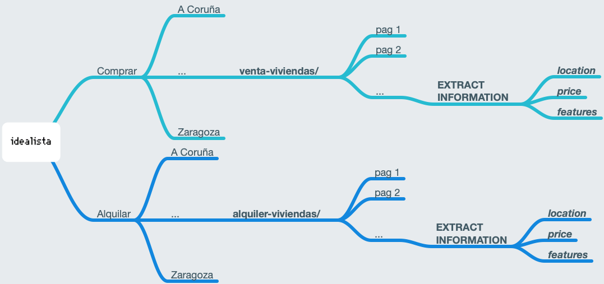

# spa-housing-crawler

Web Crawler for scraping spanish housing prices from **_idealista.com_**

 

## Instructions

1. Clone the repo
1. Install scrapy: `pip install scrapy`
1. Using terminal, go to the project folder & run: `scrapy crawl basic -o houses.csv`

 

Note: if doesn't work, try changing the User-Agent:

- Check your User Agent (*Chrome's Dev Tool can be helpfull*)
- Paste it into _settings.py_ file

 

## Navegation path:

