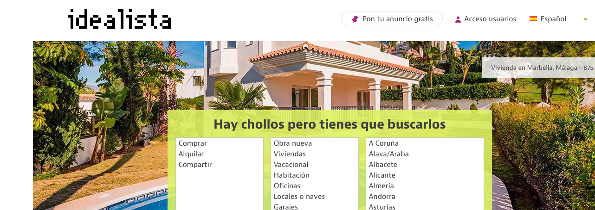

# spa-housing-crawler

Web Crawler for scraping Spanish housing data from **_idealista.com_**

 

## Prepare environment

First of all, appropriate environment is needed to run the crawler:

1. Clone the repo
1. Install scrapy: `pip install scrapy`
1. Install random-user-agent module `pip install scrapy-random-useragent`
1. (*Pandas is also required*)

 

## Houses data extraction

The time needed for extracting all houses data stored in *idealista.com* is huge. For that reason, the crawler is not design for extracting all in one shot, but in many. 
So there are 3 main stages, with 3 different spiders:

 

### First stage: Extracting all the zones/subzones links

#### How to run the first stage?

+ Run the script called `main_links.py` (*both zones & subzones links extraction are automatized in it*)

 

#### How it works?

In *idealista.com* there is data from over 50 Spain provinces.
On the other hand, there are 2 main choices for each one: Renting or Selling.
Every combination has it’s own path, so the first thing the crawler does is to extract all this links and save them into a csv file called `zones.csv`.
This task is carried out by the **GetZones** spider .

Besides, is not possible to extract over 1.800 houses from each province main-page.
Since there are provinces which have around 50.000 or 70.000 houses, this approach is not enough.
So, instead of extracting houses from the main province link, the crawler sniffs all the subzones of each province and saves the links just if they have up to 1.800 houses.
If there is a subzone wich has more than 1.800 houses, the crawler dives into this subzone and extracts links of each neighborhood.
This task is made by the spider **GetLinks**, and all the extracted links are saved into `links.csv` file.

 

### Second stage: Extracting houses data

#### How to run the second stage?
After creating `links.csv`:
+ run the script called `main_houses.py`
+ choose in the poped window the province where you want to extract houses data:

 

#### How it works?

Once we have all the zones/subzones/neighborhoods links in `links.csv`, the next step is extracting houses data.
But, as in the web page there are stored over one million and half houses, trying to extract all of them in one shot would be dramatic.
So instead, you choose just the provinces you want to extract, and the crawler starts first getting the links of each house in this province, and then, parsing and extracting all the relevant data from each house page.

Probabily you will get blocked during more than once  (much more!) during extraction. Don't worry. 
The crawler is developed for stopping and reloading after a while whenever gets blocked.
Additionaly, it saves all the denied houses-links and subzones-links in `logHouse.txt` and `logLink.txt`files respectively.
Then, once it finishes extracting all the houses, the crawler retries getting this previously blocked houses data.
 
 
### Third stage: Dataset creation

TODO!